# Automatización de Procesos de Facturación con Power Automate

Recreación personal (con datos ficticios) de un sistema de automatización de
gestión documental desarrollado originalmente durante mi experiencia como
Data Analyst / Data Engineer en Niyval. Los flujos aquí documentados replican
la lógica real aplicada en un entorno de cliente, usando datos y una cuenta
propia para poder mostrar el trabajo libremente, sin comprometer información
confidencial del cliente original.

## Contenido

- [Contexto](#contexto)
- [Flujo 1: Ingesta y permisos](#flujo-1--ingesta-dinámica-de-datos--permisos-por-elemento)
- [Flujo 2: Notificación por estado](#flujo-2--notificación-automática-por-cambio-de-estado)
- [Flujo 3: Alerta semanal](#flujo-3--alerta-semanal-de-facturas-pendientes)
- [Flujo 4: Versionado mensual](#flujo-4--versionado-mensual-con-exportación-a-excel)
- [Stack](#-stack)

>Haz click en la imagen para verla en tamaño completo.

## Contexto

El sistema gestiona un flujo de facturación end-to-end: desde la ingesta
dinámica de datos hasta el seguimiento operativo y la generación de reportes,
usando **Power Automate**, **SharePoint** y **Excel**.

## Flujo 1 — Ingesta dinámica de datos + permisos por elemento

Extrae filas desde una tabla de Excel, valida duplicados antes de crear cada
elemento en una lista de SharePoint, y asigna permisos de forma dinámica al
responsable de cada factura (rompiendo la herencia de permisos y otorgando
acceso individual mediante llamadas HTTP a la API REST de SharePoint).

<table>
<tr>
<td width="50%">

**Flujo completo**
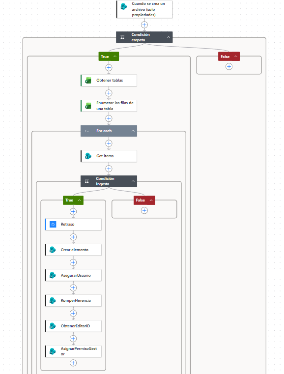

</td>
<td width="50%">

**Vista del administrador (todos los elementos)**
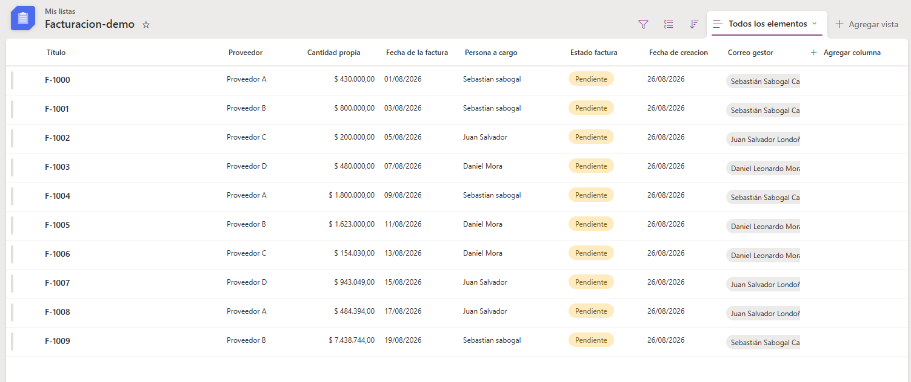

</td>
</tr>
</table>

**Secuencia de asignación de permisos:**

<table>
<tr>
<td width="25%">

**1. AsegurarUsuario**
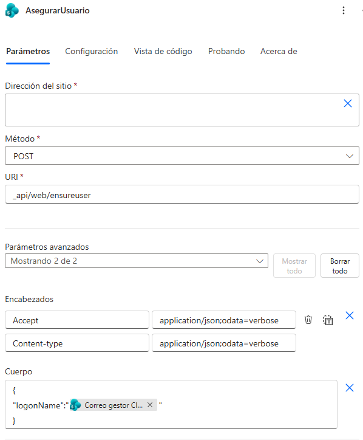
Resuelve el correo del responsable a un ID de usuario del sitio.

</td>
<td width="25%">

**2. RomperHerencia**
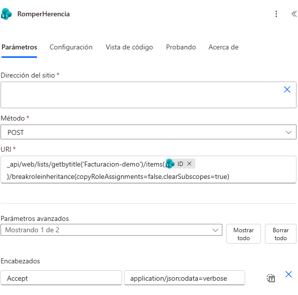
Rompe la herencia de permisos del elemento.

</td>
<td width="25%">

**3. ObtenerEditarID**
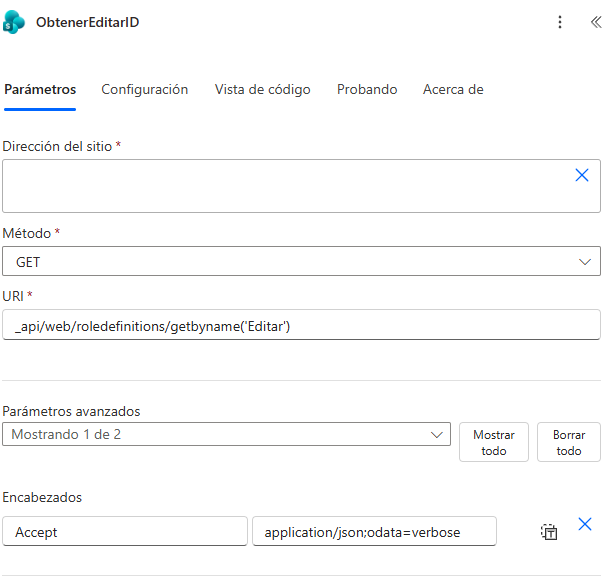
Consulta el ID del nivel de permiso "Editar".

</td>
<td width="25%">

**4. AsignarPermisoGestor**
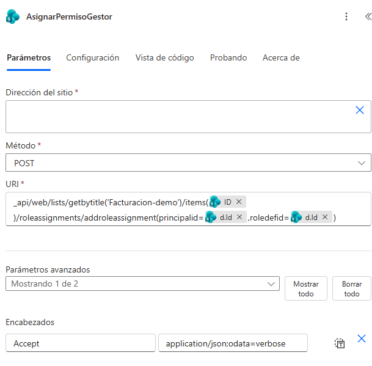
Asigna el permiso individual al responsable.

</td>
</tr>
</table>

**Resultado: vista segmentada por permisos**

<table>
<tr>
<td width="33%">

**Vista individual — usuario 1**
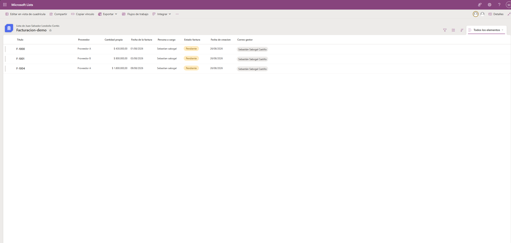
Solo ve el elemento donde es responsable.

</td>
<td width="33%">

**Vista individual — usuario 2**
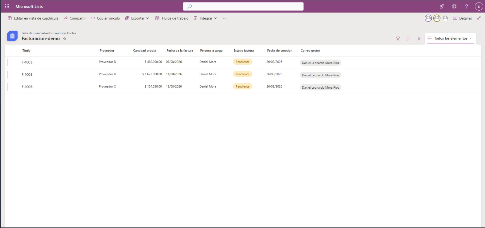
Solo ve el elemento donde es responsable.

</td>
<td width="33%">

</td>
</tr>
</table>

## Flujo 2 — Notificación automática por cambio de estado

Detecta cuando una factura cambia de estado a "Validado" y envía una
notificación automática al responsable correspondiente.

<table>
<tr>
<td width="50%">

**Flujo completo**
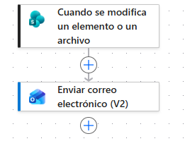

</td>
<td width="50%">

**Ejecución exitosa**
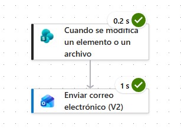

</td>
</tr>
<tr>
<td width="50%">

**Condición del desencadenante**
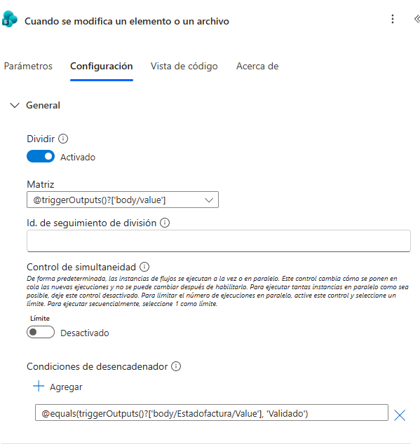
Filtra el disparo del flujo solo cuando el estado cambia a "Validado".

</td>
<td width="50%">

**Lógica de envío (destinatario dinámico)**
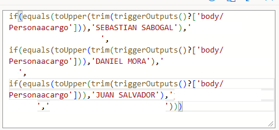
Mapea el responsable a su correo real.

</td>
</tr>
</table>

**Correo recibido:**

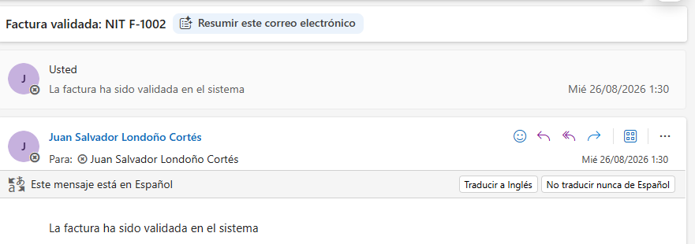

## Flujo 3 — Alerta semanal de facturas pendientes

Flujo programado que revisa semanalmente las facturas pendientes, agrupa los
responsables únicos y envía a cada uno un resumen segmentado solo con sus
propias facturas pendientes.

<table>
<tr>
<td width="50%">

**Flujo completo**
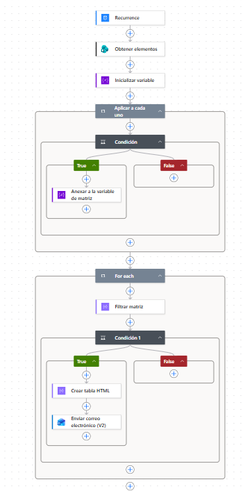

</td>
<td width="50%">

**Ejecución exitosa**
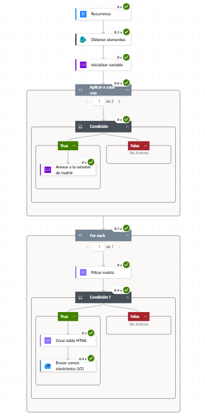

</td>
</tr>
</table>

**Paso 1 — Construcción de la lista de responsables únicos:**

<table>
<tr>
<td width="33%">

**Filtro: solo pendientes**
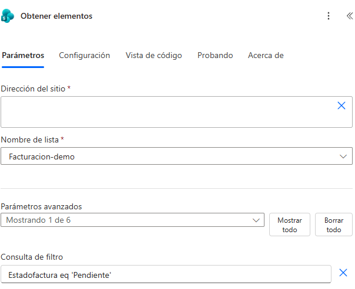

</td>
<td width="33%">

**Correo aún no está en la matriz**
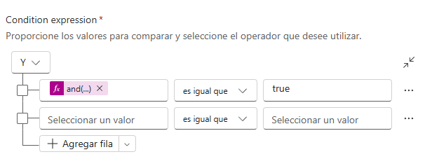

</td>
<td width="33%">

**Expresion de la condicion para la matriz**
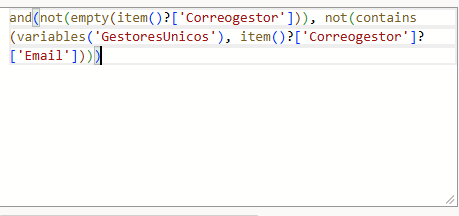

</td>
</tr>
</table>

**Paso 2 — Envío segmentado por responsable:**

<table>
<tr>
<td width="25%">

**Deduplicación de la matriz**
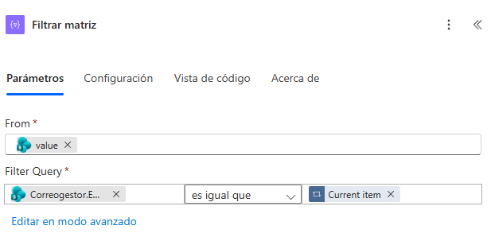

</td>
<td width="25%">

**Match: factura del responsable actual**
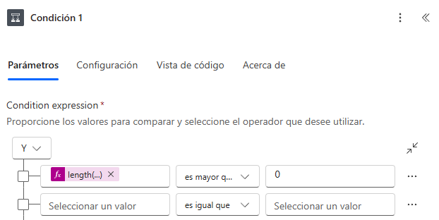

</td>
<td width="25%">

**Expresion de la condicion para la factura del responsable**
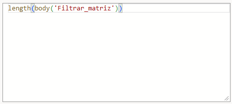

</td>
<td width="25%">

**Creación de la tabla HTML**
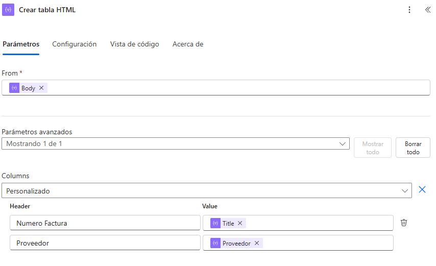

</td>
</tr>
</table>

**Correo recibido (segmentado por responsable):**

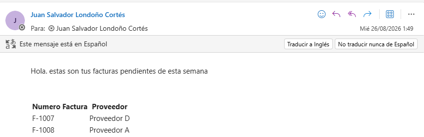

## Flujo 4 — Versionado mensual con exportación a Excel

Consolida mensualmente los registros del período y genera un archivo Excel
con el historial de datos para trazabilidad.

<table>
<tr>
<td width="50%">

**Flujo completo**
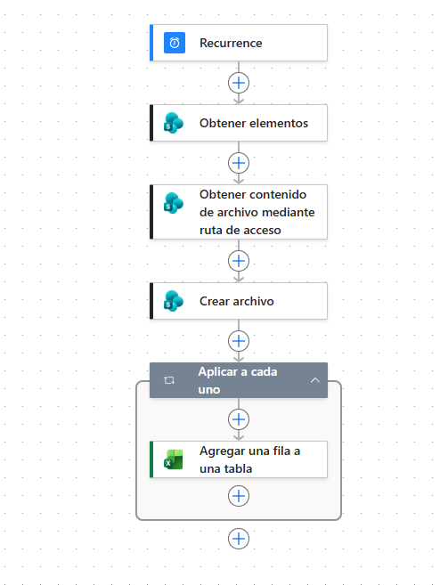

</td>
<td width="50%">

**Filtro por rango de fechas (mes actual)**
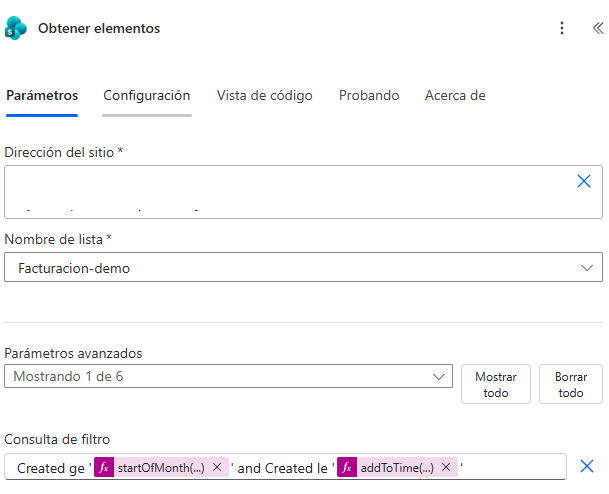

</td>
</tr>
<tr>
<td width="50%">

**Ejecución exitosa**
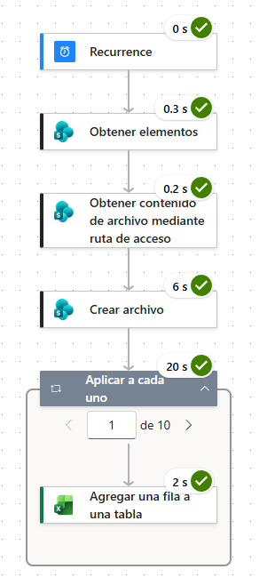

</td>
<td width="50%">

**Excel generado**
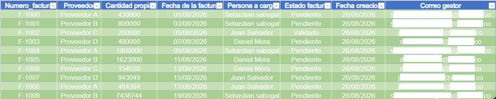

</td>
</tr>
</table>

## Stack

Power Automate · SharePoint (API REST) · Excel Online · Power Platform

## Nota

Los datos de facturas, proveedores y responsables mostrados son **ficticios**,
creados exclusivamente para esta demostración. La lógica y arquitectura de
los flujos reflejan fielmente el trabajo realizado en un contexto profesional real.
